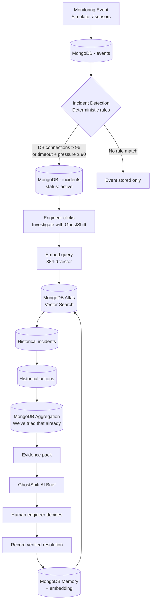
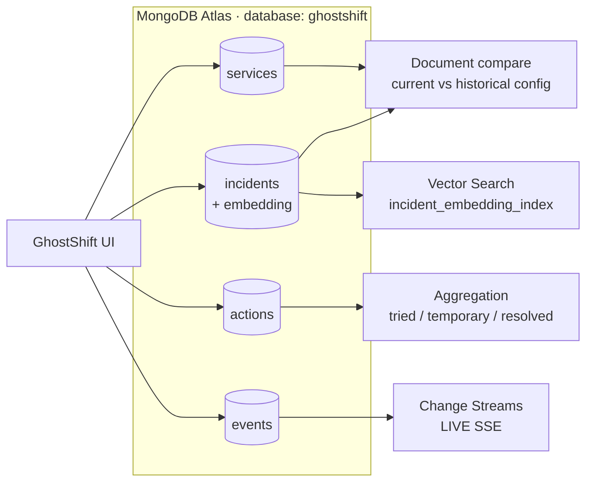
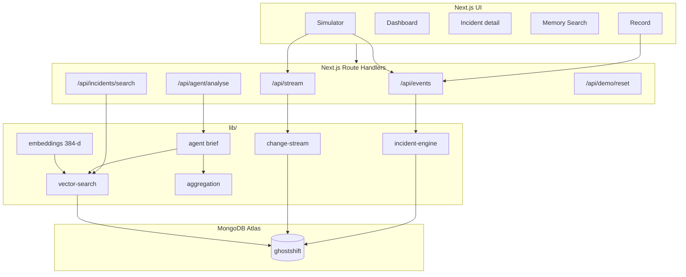

# GhostShift Memory Agent

**Institutional memory for engineering teams.**  
*When people leave, their technical knowledge shouldn’t leave with them.*

GhostShift is a MongoDB-powered **AI incident command centre**.  
It does **not** auto-fix production. It helps engineers investigate faster by retrieving what the organisation has already learned.

---

## One-sentence pitch

> Monitoring opens an incident with **deterministic rules**. MongoDB retrieves **historical memory**. AI explains the **evidence**. A **human** decides what to do.

---

## What problem does this solve?

Engineering knowledge is trapped in Slack threads, people who left, and half-remembered war stories.

When a new failure looks familiar, teams often:

1. Restart services (again)
2. Raise timeouts (again)
3. Miss that those steps already failed historically

GhostShift turns past incidents into **searchable organizational memory** in MongoDB Atlas.

---

## How responsibility is split

| Layer | Who owns it | What it does |
| --- | --- | --- |
| **Detection** | Deterministic rules | Opens an incident from monitoring events |
| **Memory** | MongoDB Atlas | Stores, searches, aggregates, streams evidence |
| **Explanation** | GhostShift AI (optional OpenAI) | Writes an evidence-grounded brief |
| **Decision** | Human engineer | Chooses the next action — never auto-remediation |

That separation is intentional and easy to defend to judges.

---

## End-to-end flow



---

## How MongoDB is used (judging map)



| GhostShift capability | MongoDB feature |
| --- | --- |
| System history & configs | **Documents** (`services`, `incidents`) |
| Live monitoring events | **Documents** (`events`) |
| Similar previous failures | **Atlas Vector Search** on `incidents.embedding` |
| “We've tried that already” | **Aggregation** on `actions` |
| Live dashboard updates | **Change Streams** → SSE `/api/stream` |
| Current vs historical config | **Document queries / compare** |
| New verified fix becomes memory | **Persist + embed** into `incidents` (+ `actions`) |

---

## Collections

| Collection | Purpose |
| --- | --- |
| `services` | Live service status + current config |
| `incidents` | Historical + live incidents, each with a **384-d embedding** |
| `actions` | What engineers tried: `failed` / `temporary` / `resolved` |
| `events` | Monitoring inserts that drive detection + the live feed |

**Vector Search index**

- Name: `incident_embedding_index`
- Path: `embedding`
- Dimensions: **384**
- Similarity: **cosine**

Seeded incidents, recorded resolutions, live incidents, and search queries all use the **same** `embedText()` method so vectors stay comparable.  
If Atlas Vector Search is unavailable, GhostShift falls back to **local cosine ranking** and labels that honestly in the UI.

---

## Demo detection rules (Payment API only)

```text
RULE 1
  DB connections ≥ 96
  → open active incident

RULE 2
  Timeout / latency ≥ 2000 ms
  AND DB pressure ≥ 90 in the last 30 minutes
  → open active incident
```

- At most **one active incident per service**
- Never auto-remediates
- Other services store events but do not auto-open incidents in this MVP

---

## 3-minute judge demo

1. Open **[http://localhost:3000/dashboard](http://localhost:3000/dashboard)**  
   - Service health cards, MongoDB activity strip, Change Stream badge  
2. Open **Simulator** → reset demo if needed  
3. Fire **DB Load 96%**  
   - Dashboard updates live via **Change Stream**  
   - Payment API flips to **CRITICAL** / active incident  
4. Click **Investigate with GhostShift**  
5. Watch the **Memory Trace**:  
   `Current incident → Embedding → Vector Search → Matches → Aggregation → AI brief → Human decides`  
6. Point out:
   - High-ranked historical match (e.g. `INC-001` / `INC-010`)
   - “We've tried that already” (**Aggregation**)
   - Freshness warning when historical config differs
   - Search Engine badge (**Atlas Vector Search** *or* honest cosine fallback)
7. Optional: **Memory Search** scenario chips (high / conflict / low confidence)
8. Optional: **Record** a verified fix → it is embedded and becomes searchable

---

## Confidence scenarios in seed memory

After `npm run seed`:

| Count | Data |
| --- | ---: |
| Services | 3 |
| Historical incidents | **17** |
| Actions | **54** |

| Scenario | Example | Expected behaviour |
| --- | --- | --- |
| **High confidence** | Pool saturation (`INC-001`, `INC-010`) | Strong semantic matches for the live demo |
| **Conflict / medium** | Provider / missing index / DNS (`INC-002`, `INC-011`, `INC-014`) | Similar symptoms, different root causes → caution |
| **Outdated knowledge** | Legacy pool max 5 (`INC-013`) | Freshness warning vs today’s pool 100 |
| **Low / sparse** | EU tax / currency (`INC-017`, `INC-012`) | Weak matches → low confidence, no invented fix |
| **Tried that already** | Restarts + timeout bumps across many incidents | Aggregation shows temporary/failed outcomes |

Low confidence means: **show evidence, warn the human, do not act.**

---

## Architecture (app)



---

## Run locally

```bash
npm install
copy .env.example .env.local   # Windows
# cp .env.example .env.local   # macOS / Linux
```

Set `MONGODB_URI` to your Atlas connection string.  
Allow your IP in Atlas **Network Access**.

```bash
npm run seed
npm run dev
```

Open **http://localhost:3000**

### Environment

| Variable | Required | Purpose |
| --- | --- | --- |
| `MONGODB_URI` | **Yes** | Atlas connection string |
| `OPENAI_API_KEY` | No | Optional grounded AI wording over MongoDB evidence |
| `OPENAI_MODEL` | No | Default `gpt-4o-mini` |

Database name is always **`ghostshift`**.

`npm run seed` wipes demo collections, inserts services/incidents/actions, generates embeddings, and ensures the Vector Search index.  
**Events are left empty** so the live simulator demo starts clean.

`POST /api/demo/reset` clears **live** events + active incidents only. Historical memory stays.

---

## Product rules (non-negotiable)

1. Historical root causes are **evidence**, not confirmed current causes  
2. Action statistics come from **MongoDB Aggregation**, never invented by the LLM  
3. **No autonomous remediation**  
4. Temporary actions use `successful: false`; only `resolved` uses `successful: true`  
5. UI must label **Atlas Vector Search** vs **local cosine fallback** honestly  

---

## Project layout

```text
app/                 UI pages + API routes
components/          Dashboard, simulator, Mongo trace, branding
lib/                 MongoDB, detection, embeddings, vector search, agent
src/ai/              Optional grounded AI analysis layer
data/                Seed services / incidents / actions
scripts/seed.ts      Embed + load Atlas
```

---

## Stack

- **Next.js 16** (App Router) + React 19 + TypeScript  
- **MongoDB Atlas** — Documents, Vector Search, Aggregation, Change Streams  
- **Optional OpenAI** — evidence-grounded briefs only  

---

## What to say if judges ask “Why isn’t detection AI?”

> For the prototype, incident triggering is deliberately deterministic and explainable.  
> The intelligence is used **after** detection — to retrieve and reason over historical organizational memory in MongoDB.
